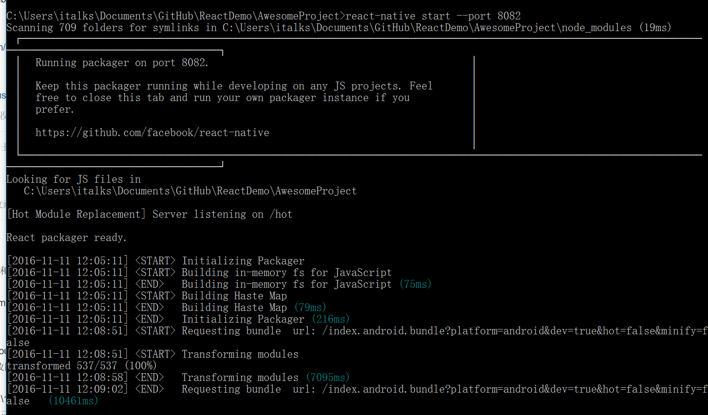
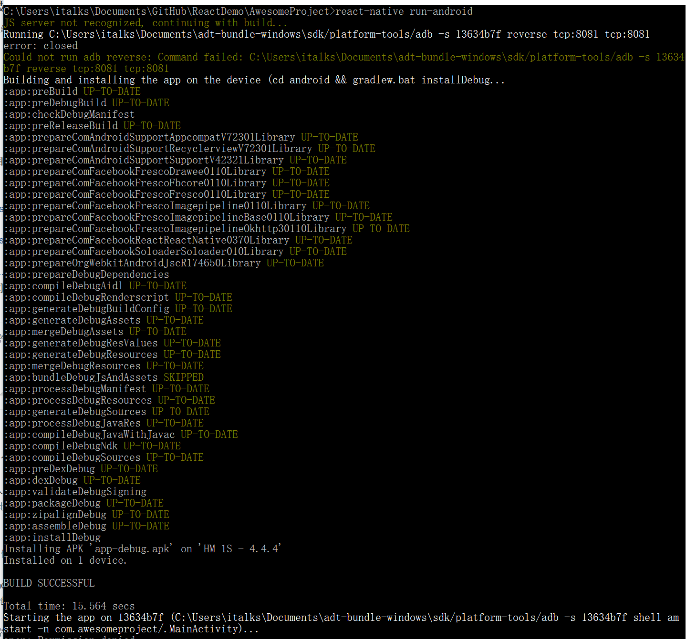
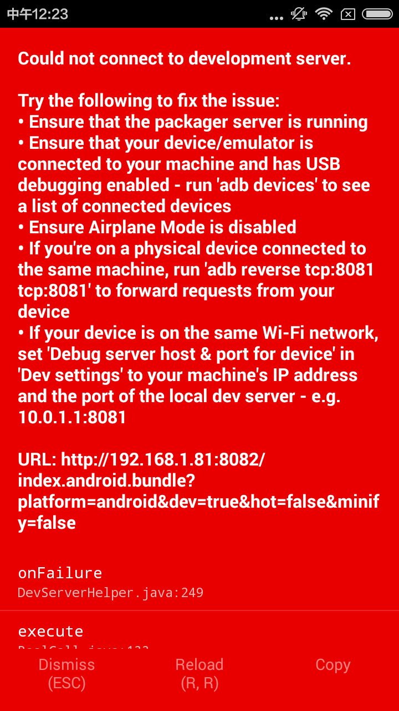
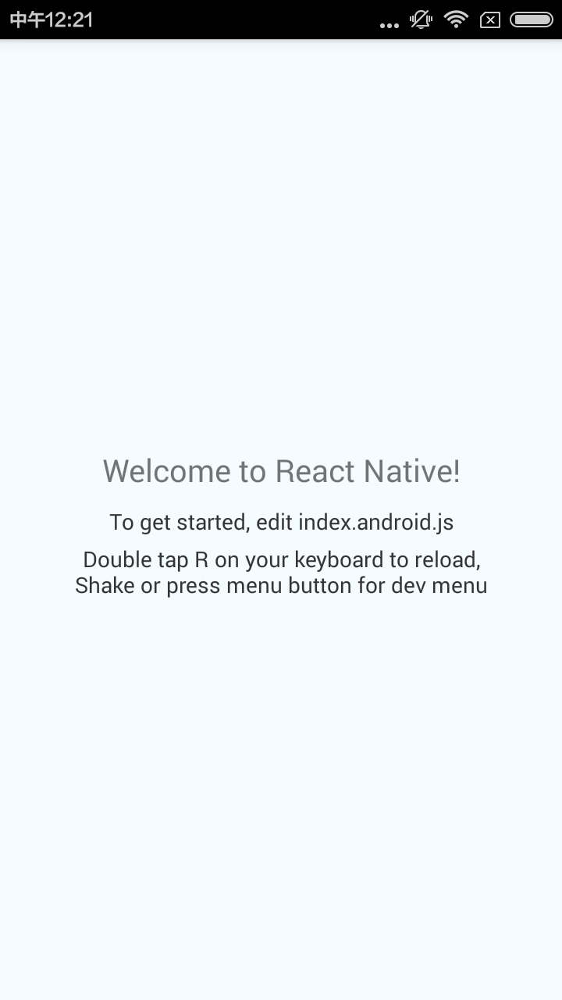

#测试React Native步骤
##1、先要react-native start

通过--port指定其他端口（如果你的默认端口被占用）

##2、react-native run-android

###1、白屏问题
小米手机会遇到白屏的问题，可以通过开启悬浮窗权限，来解决

###2、如何连接测试服务器
android 5.0以上的通过USB可以直接调试；
android 5.0以下的设备需要wifi连接本地的测试环境
http://reactnative.cn/docs/0.37/running-on-device-android.html
